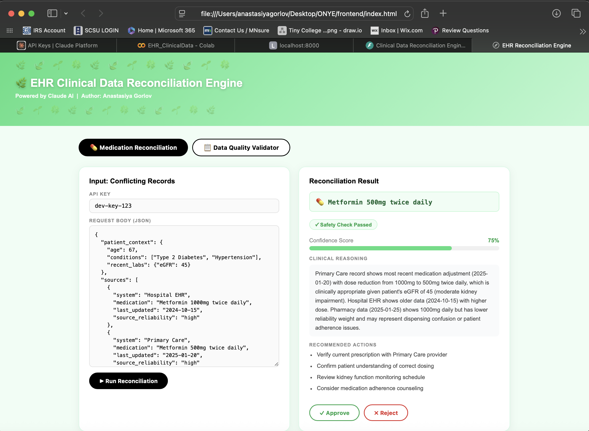
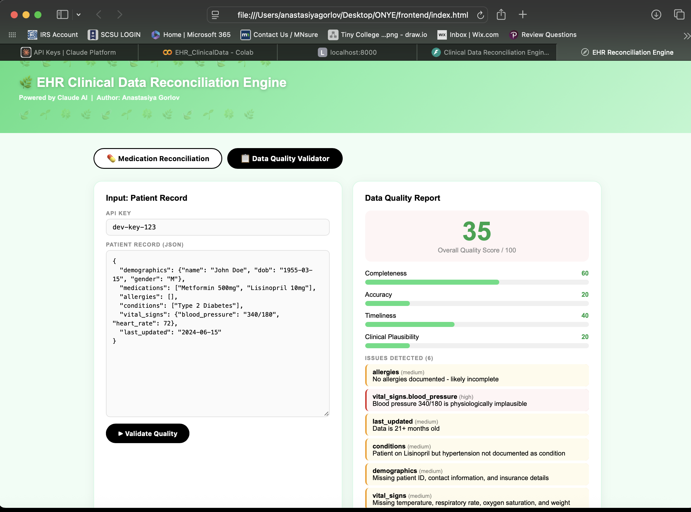

# Clinical Data Reconciliation Engine

Author: Anastasiya Gorlov  
Date: March 2026  
Assessment: Full Stack Developer - EHR Integration Intern  

---

## Overview

This is an AI-powered application that reconciles conflicting medication records and evaluates patient data quality.

In real healthcare systems, patient data comes from multiple sources (hospital, primary care, pharmacy) and often conflicts. This tool helps determine the most accurate version and identifies potential issues.

The system uses Claude AI for reasoning along with basic rule-based validation.

---

## Screenshots

### Medication Reconciliation

### Data Quality Validator

## How to Run Locally

1. Clone the repo:
git clone<your-repo-url>
cd ONYE/backend

2. Install dependencies:
pip install -r requirements.txt

3. Create environment file:
cp.env.example.env

4. Add your API key inside ".env":
ANTHROPIC_API_KEY=your_key_here
APP_API_KEY=dev-key-123

5. Start the backend server:
python3 main.py 

or 

uvicorn main:app--reload

6. Open the frontend:

Open `frontend/index.html` in your browser

7. Access API docs:
http://localhost:8000/docs

---

## API Endpoints

### POST /api/reconcile/medication

Reconciles conflicting medication records.

Input:
- patient context
- multiple medication sources

Output:
- reconciled medication
- confidence score
- reasoning
- recommended actions
- safety check
- duplicate detection

---

### POST /api/validate/data-quality

Evaluates quality of patient data.

Input:
- patient record

Output:
- overall score (0-100)
- breakdown (completeness, accuracy, timeliness, plausibility)
- issues detected
- summary

---

### GET /

Health check endpoint to confirm the server is running.

---

## Authentication

All POST endpoints require:
x-api-key: dev-key-123

This is a simple API key for demonstration purposes.

---

## Tech Stack

- Python
- FastAPI
- Anthropic Claude AI
- HTML / CSS / JavaScript

---

## Key Design Decisions

Python + FastAPI:
Used Python to focus on solving the problem quickly. FastAPI provides automatic API documentation and clean routing.

Separation of concerns:
- main.py handles API routing, authentication, and caching
- reconcile.py handles medication reconciliation logic
- validate.py handles data quality validation

Caching:
Simple in-memory cache is used to avoid repeated AI calls and reduce cost.

Rule-based checks:
Basic validation (blood pressure, missing allergies, outdated data) is performed before calling AI.

Prompt design:
Claude is given structured clinical context and required to return strict JSON output for reliable parsing.

---

## Bonus Features

- Confidence scoring based on source reliability
- Duplicate medication detection
- Docker containerization

---

## Testing

Run tests with:
pytest

---

## Docker (Bonus)

Build and run:

docker build -t ehr-engine .
docker run --env-file .env -p 8000:8000 ehr-engine

## Project Structure

ONYE/
  backend/
    main.py          - web server + 2 endpoints + auth + cache
    reconcile.py     - medication reconciliation AI logic
    validate.py      - data quality validation AI logic
    requirements.txt - Python libraries needed
    Dockerfile       - bonus Docker setup
    .env             - secret API keys (not uploaded to github)
  tests/
    test_core.py     - 5 unit tests covering core logic
  frontend/
    index.html       - clinician dashboard webpage
  EHR_ClinicalData.ipynb  - AI integration development notebook
  README.md          - this file
  .gitignore         - keeps secrets off GitHub

---

## What I Would Improve

- Add a database to store reconciliation history
- Improve medication normalization (e.g. RxNorm)
- Add async processing for AI calls
- Expand unit test coverage
- Improve frontend for real clinical workflows

---

## Notes

This project focuses on building a clean backend, structured AI integration, and a simple but usable frontend.

The goal was reliability, clarity, and practical application in a healthcare context.
